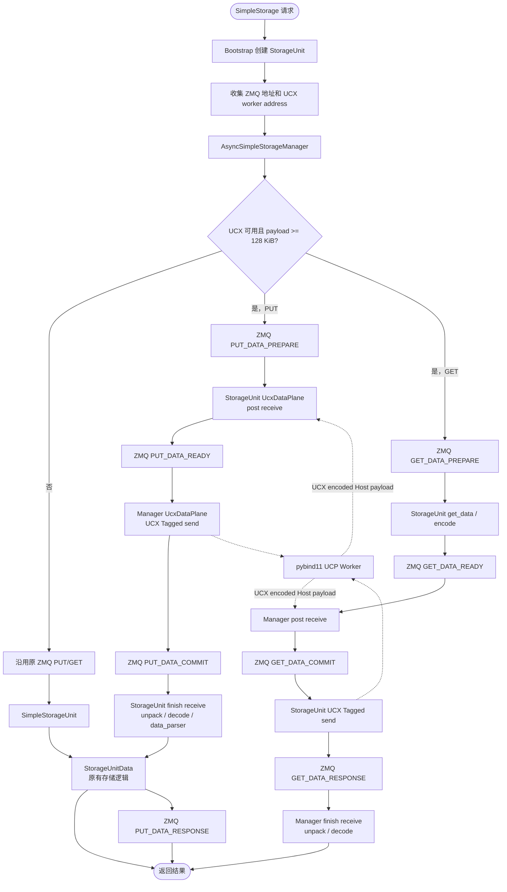

# SimpleStorage Payload Transport 需求串讲

> 状态：已实现可选的 Host UCX Tagged 数据通道，默认关闭。现有验证证明功能可用，但尚未
> 证明相对 ZMQ 有稳定收益，因此不能默认启用。

## 1. 需求与边界

SimpleStorage 保留现有 KV API 和存储语义，只允许编码后的大 Host payload 绕过 ZMQ 大消息
传输。

| 项目 | 当前约束 |
| --- | --- |
| 公开 API | 不改变 `kv_put`、`kv_batch_get`、`kv_clear`。 |
| 控制面 | ZMQ 负责路由、descriptor、地址交换、状态、错误和取消。 |
| 数据面 | 大 Host payload 使用 UCX Tagged；小 payload 使用 ZMQ。 |
| 存储语义 | 不改变哈希路由、`data_parser`、CLEAR 和 checkpoint 对象格式。 |
| 设备内存 | 当前不支持 GPU/NPU device memory。 |
| 默认行为 | `payload_transport.enabled: false`，保持原 ZMQ 路径。 |

当前不包含 UCX RMA、透明 endpoint 重连、控制面自动恢复和 GPU/NPU 直传。

### 为什么选择 UCX

UCX 在同一套 UCP Tagged 接口下覆盖跨节点 RDMA、TCP 和同机 shared memory；TQ 因而不必
自行维护 Verbs 的 QP、内存注册、完成队列和建连细节。Tagged Send/Receive 也与现有
PUT/GET 的 request-response 模型直接对应。ZMQ 继续承担控制面，UCX 不可用时仍可回退原
ZMQ 数据路径。

这是一层 Host 传输抽象，而不是“开启即保证 RDMA”或性能收益的承诺：实际数据通道由部署的
UCX 和网络能力决定，必须以实际 lane 验证为准。它也不意味着 UCX 能直接传输 Ascend NPU
内存；NPU 将使用独立后端。

## 2. 数据路径

```text
                         ZMQ control plane
Manager  ------------------------------------------------  StorageUnit
         PREPARE / READY / COMMIT / CANCEL / response

                         UCX Tagged
Manager  ================================================= StorageUnit
                       encoded Host payload
```

组件交互流程：



其中 Manager 和 StorageUnit 之间始终保留 ZMQ 控制通道；UCX 只负责传输已经编码的 Host
payload。小 payload、UCX 初始化失败或能力不匹配时，走左侧 ZMQ 分支。

PUT 顺序：

```text
PUT_PREPARE(descriptor, indexes, parser)
StorageUnit post receive
UCX send
PUT_COMMIT
decode -> data_parser -> put_data
PUT_RESPONSE
```

GET 顺序：

```text
GET_PREPARE(indexes, fields, receiver address)
StorageUnit get_data -> encode
Manager post receive
GET_COMMIT
StorageUnit UCX send completes
GET_RESPONSE
Manager finish receive -> decode
```

`data_parser` 仍在 StorageUnit 收到并解码 PUT 后执行，不改变既有语义。自动回退只发生在
传输开始前；PREPARE 后发生的失败返回错误并清理 pending 状态，不透明重放。

### 为什么需要 PREPARE / READY / COMMIT

原 ZMQ 路径在一条消息中同时传输控制信息和 payload，因此只有请求和响应即可。UCX 路径将
两者分开：

```text
PREPARE：传 descriptor，接收端准备 buffer
READY：接收端可以接收
UCX：传输 payload
COMMIT：传输完成后进入 decode / parser / storage
RESPONSE：业务处理完成
```

这些状态不是 UCX 的强制 API，而是 TQ 用来区分“接收已准备”“字节已传输”和“业务已提交”。
否则发送端无法可靠判断对端是否已准备、存储是否成功，超时或重试也可能留下未回收请求或
重复写入。状态协议也为 GET 提供了先确定 payload 大小、再 post receive 的同步点。

## 3. 用户配置

仓库默认配置：

```yaml
backend:
  SimpleStorage:
    payload_transport:
      enabled: false
```

完成环境准入并确认有收益后，只需改为：

```yaml
payload_transport:
  enabled: true
```

业务用户不配置 NIC、GID、UCX transport 或 worker address。

开启后，TQ 内部执行：

1. 从本机网络和 Linux RDMA sysfs 解析 RoCE-v2 device、port 和 GID；
2. 优先匹配 Ray 本机 IP；控制网与 RoCE 网分离时，仅接受唯一候选，多候选时回退 ZMQ；
3. 创建 UCP worker，交换并校验 address；
4. 大于等于 128 KiB 的 payload 使用 UCX，小 payload 使用 ZMQ；
5. 大 payload 作为一个逻辑 UCX Tagged request 提交，由 UCX 处理底层分片。

其中 128 KiB 只是当前内部候选阈值，不是 UCX 限制，也不是现有实验推导出的性能拐点。后续
应根据包含编码、控制面、传输和解码落库的端到端对照结果调整；阈值仍由 TQ 内部维护，不
增加用户配置项。TQ 不额外设置 1 GiB 或 64 GiB 的逻辑 payload 上限。
packed frame 的 offset/size 使用 64 位无符号整数，理论上限约为 16 EiB；实际仍受 64 位进程
地址空间、可用内存和 UCX 接口限制。当前一个逻辑 payload 仍要求一个连续 buffer，超出单
buffer 能力时需要后续的分块协议。

TQ 不写死特定网卡、设备厂商、UCX 安装目录或 transport 名称。Host RoCE 场景下，TQ 查询
当前 UCX runtime 的可用 transport 后生成 UCP 配置；如果进程显式设置 `UCX_TLS`，则保留
显式值。实际 transport 仍由部署环境中的 UCX 和设备能力决定；在应用级实际 lane 指标
完成前，`provider=ucx` 不能直接等同于 `route=rdma`。

### 3.1 高级手动配置

正常部署不需要设置 UCX 参数。需要指定网络或排障时，可以在创建 Ray worker/StorageUnit
之前，通过进程环境变量覆盖自动发现结果：

```bash
export UCX_TLS=rc_verbs,tcp,sm,self
# Replace the following values with the device, interface and GID on the node.
export UCX_NET_DEVICES=rdma_device:port,tcp_interface
export UCX_IB_GID_INDEX=gid_index
export UCX_IB_ADDR_TYPE=ib_global
```

参数含义：

| 环境变量 | 作用 | 默认行为 |
| --- | --- | --- |
| `UCX_TLS` | 指定可用 transport；`rc_*` 是 RDMA 数据通道，`tcp` 可作为辅助建连通道 | TQ 根据 `ucx_info -d` 自动选择 |
| `UCX_NET_DEVICES` | 指定 RDMA device/port 和 TCP 网卡 | TQ 根据本机 GID 自动生成 |
| `UCX_IB_GID_INDEX` | 指定 RoCE GID index | TQ 自动匹配本机 IP |
| `UCX_IB_ADDR_TYPE` | 指定 GID 地址类型 | RoCE 场景默认为 `ib_global` |
| `TQ_UCX_INFO` | 指定 TQ 用于能力探测的 `ucx_info` 可执行文件 | 从 `PATH` 或已加载 UCX runtime 查找 |
| `UCX_LOG_LEVEL` | 设置 UCX 日志级别，例如 `info`、`debug` | 不由 TQ 设置 |
| `UCX_LOG_FILE` | 将 UCX 日志写入指定文件 | 不由 TQ 设置 |

优先级为：

```text
显式环境变量 > TQ 自动发现 > UCX 默认值
```

环境变量必须对所有参与传输的节点和 Ray worker 生效；只在 driver shell 中设置而没有传递给
StorageUnit/Manager 进程不会生效。手动指定 `UCX_NET_DEVICES` 或 GID 后，应同时确认对应
device、网卡和 GID 在每个节点都存在，并重新执行 UCX Tagged 双机验证。

`UCX_TLS`、NIC 和 GID 是高级覆盖项，不增加 TQ 的公开 YAML 配置项。普通用户仍只需要设置
`payload_transport.enabled: true`。`UCX_RNDV_THRESH`、`UCX_TCP_CM_ROUTE` 等其他 UCX
参数可以按 UCX runtime 文档通过环境变量传入，但 TQ 不校验其兼容性；修改前应保留默认值，
并通过日志确认最终 transport。

## 4. 部署准入

跨节点 Host payload 要使用 RDMA，集群管理员需要保证：

1. 节点具有可用的 RDMA 驱动、固件、rdma-core 和互通的 RoCE-v2 网络；
2. 节点基础镜像提供与硬件兼容的 UCX runtime；
3. TQ wheel 包含 `transfer_queue._ucx` 薄 binding，且与运行时 UCX ABI 兼容；
4. Verbs 基线和 UCX Tagged 跨节点测试均通过；
5. UCX 实际 payload lane 已确认是 RDMA，而不是 TCP。

TQ wheel 不打包 UCX、rdma-core 或网卡驱动，也不包含构建机绝对 RPATH。任一 StorageUnit
未能初始化 UCX 时，bootstrap 不发布 UCX endpoints，所有 Manager 使用 ZMQ；个别 Manager
初始化失败时，仅该 Manager 回退 ZMQ。

## 5. 代码边界

| 文件 | 职责 |
| --- | --- |
| `storage/bootstrap/simple_storage_bootstrap.py` | 创建 StorageUnit，收集 UCX endpoint metadata。 |
| `storage/managers/simple_storage_manager.py` | 选择 ZMQ/UCX，执行 PUT/GET 握手和取消。 |
| `storage/simple_storage.py` | 维护 pending 状态，执行 encode/decode、parser、存储和取消回收。 |
| `storage/ucx_discovery.py` | 自动解析节点本地 RoCE-v2 device、port 和 GID。 |
| `storage/data_plane.py` | descriptor、endpoint、单 request、异步 request 和取消。 |
| `native/ucx/ucx_bindings.cpp` | Host buffer 的最小 UCP Tagged pybind11 封装。 |
| `utils/serial_utils.py` | 复用既有 frame 编码及连续 payload 打包格式。 |
| `utils/zmq_utils.py` | UCX PUT/GET 控制消息类型。 |

UCX 对象、NIC/GID、tag 和 address 均不进入公开 API。UCP worker 使用单 owner thread，
所有 UCP 调用和 progress 都在该线程执行。

## 6. GPU/NPU 兼容方向

`payload_transport.enabled` 表示允许 TQ 选择 payload 通道，不表示强制 Host RDMA，因此后续
可以保持同一配置入口：

| Payload | 候选路径 | 不满足条件时 |
| --- | --- | --- |
| Host | UCX Tagged | ZMQ |
| CUDA | UCX CUDA/GDR | D2H -> Host transport -> H2D |
| Ascend | HIXL Device Direct | CANN D2H -> Host transport -> H2D |
| CUDA 与 Ascend | 不承诺跨厂商直传 | Host staging |

后续由内部 capability 和 payload memory kind 选择 backend，不增加 `rdma`、`gpu`、`npu`
等用户开关。Device 路径必须单独定义内存注册、stream/event 完成、buffer 生命周期和回退语义。

## 7. 当前结论与启用门槛

当前已验证 Host payload 的 PUT、GET、CLEAR、`data_parser`、并发、取消和部分故障
路径。已有目标网络测试没有显示全尺寸、双方向的稳定性能收益，默认保持关闭。

正式启用前仍需完成：

- 不含构建机绝对路径的 UCX binding wheel 和干净镜像安装验证；
- 实际 lane、fallback、inflight bytes 和传输耗时指标；
- inflight 数量/字节 backpressure；
- checkpoint 与进行中 transfer 的明确互斥；
- 目标网络上的双向、并发、断连和多尺寸验收。

实验环境、命令和原始结果只记录在
[阶段 1 Host transport 验证](../rdma_phase1_host_transport_validation.md)和
[阶段 2/3 验证](../rdma_phase2_3_validation.md)中，不作为产品配置。

## 8. 参考资料

- [OpenUCX FAQ](https://openucx.readthedocs.io/en/master/faq.html)
- [OpenUCX API](https://openucx.readthedocs.io/en/master/api.html)
- [OpenUCX Features](https://openucx.readthedocs.io/en/master/ucx_features.html)
- [HIXL README](https://gitcode.com/cann/hixl/blob/master/README.md)
- [HIXL C++ 接口](https://gitcode.com/cann/hixl/blob/master/docs/zh/api/cpp/HIXL-interface.md)
- [Mooncake PR #759](https://github.com/kvcache-ai/Mooncake/pull/759)
