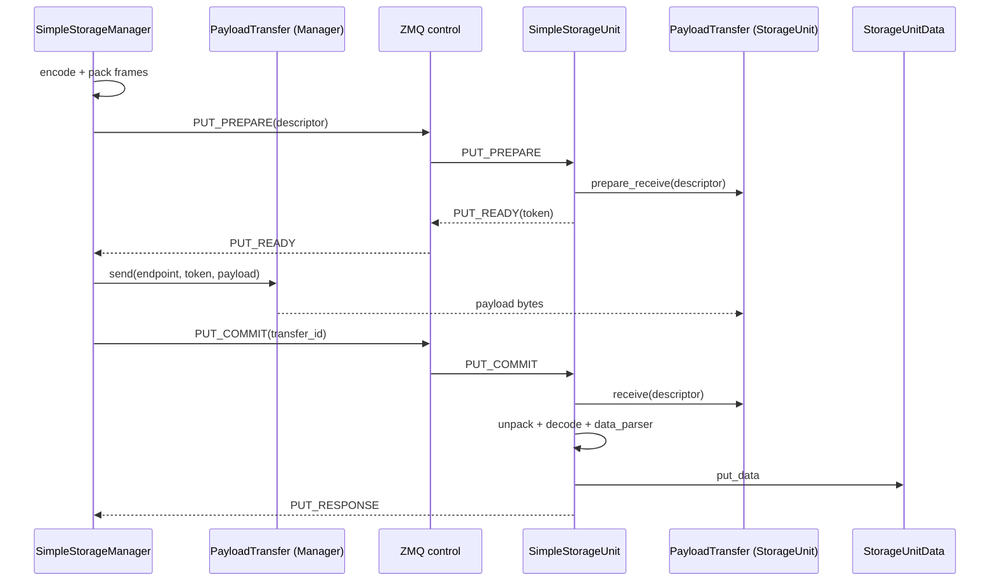
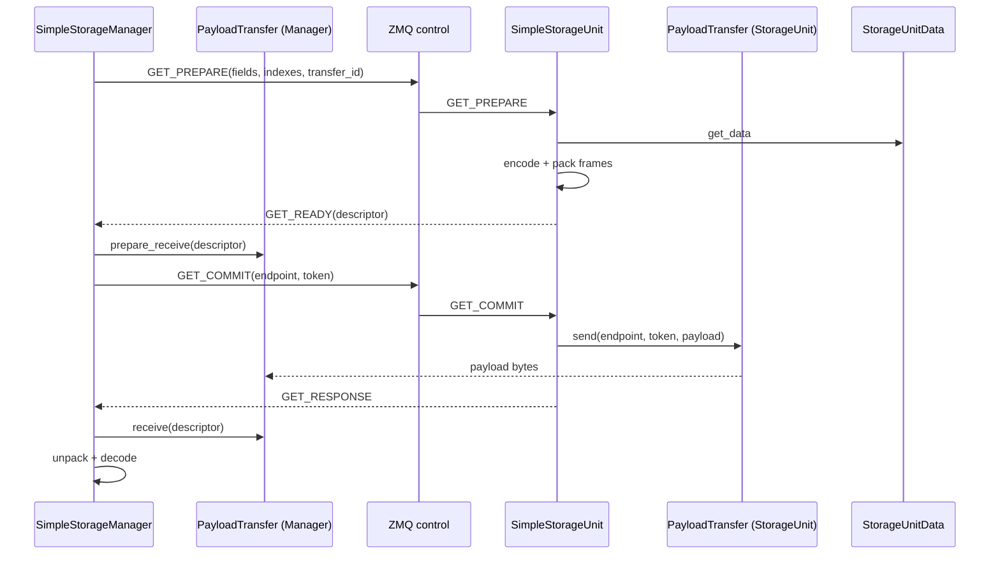

# SimpleStorage Payload Transfer

开发者安装 UCX、构建 TQ native extension、启用配置和验证实际 RDMA lane 的流程见
[`TQ UCX Host RDMA Developer Guide`](../ucx_rdma_developer_guide.md)。本文保留设计边界、
协议和组件责任，不替代环境安装手册。

## Scope

`PayloadTransfer` is a narrow, optional byte-transfer boundary for
SimpleStorage. It does not replace a storage backend and does not own routing,
serialization, object semantics, or durability.

```text
KV API / routing / data_parser / StorageUnitData
                    │
          SimpleStorage protocol
          (ZMQ control plane)
                    │
       optional PayloadTransfer
                    │
          UCX Host byte transfer
```

- `payload_transfer: zmq` is the default. It follows the original ZMQ path and
  does not create a `PayloadTransfer` object.
- `payload_transfer: ucx` keeps ZMQ for control and small payloads, and uses
  UCX Tagged send/receive for contiguous Host payloads of at least 128 KiB.
- A UCX failure is returned to the caller; it never silently falls back to
  ZMQ after a transfer has started.
- GPU/NPU direct transfer, RMA and chunking are not implemented here.

## Storage backend boundary

| Backend | Relationship to `PayloadTransfer` |
| --- | --- |
| SimpleStorage | The only current consumer. It owns the PREPARE/READY/COMMIT/CANCEL protocol and invokes the transfer for payload bytes. |
| MooncakeStorage | Unchanged. It already owns its data movement and memory lifecycle; wrapping it would duplicate its backend contract. |
| YuanRongStorage | Unchanged. Its client/backend protocol remains its transport boundary. |
| RayStore | Unchanged. Ray object transfer remains owned by Ray. |

A future backend should use this abstraction only if it shares
SimpleStorage's split control/data-plane protocol. `PayloadTransfer` is not a
mandatory layer below every storage implementation.

HIXL can later implement the same contract when the payload is already in a
supported device buffer. Device discovery, memory registration and completion
events belong in that implementation, not in SimpleStorage or the generic
descriptor.

## Contract

The generic descriptor contains only:

```text
transfer_id   protocol identity and correlation
payload_bytes receive allocation and length validation
```

Frame count and UCX tag are not control-plane fields. The frame table is
inside the packed payload, and UCX derives its tag from `transfer_id` on both
peers. `ReceiveToken` remains transport-owned because a future transport may
need receiver-generated metadata; UCX currently returns an empty token.

The transport API is deliberately small:

```text
endpoint()
prepare_receive(descriptor) -> token
send(endpoint, token, descriptor, payload) -> Future
receive(descriptor) -> Future
cancel_receive(transfer_id)
close()
```

All UCX objects and progress are owned by one dedicated thread. Requests have
a finite timeout, and the native receive result exposes UCX's actual received
length rather than the allocation capacity.

## PUT sequence



## GET sequence



PREPARE state is bounded by count, aggregate bytes and a TTL. Failed handshakes
send best-effort CANCEL, while transfer timeout remains the final guard against
an unresponsive peer.

## Configuration and build

```yaml
backend:
  SimpleStorage:
    payload_transfer: zmq  # default; use ucx to opt in
```

The native extension is also an explicit build choice:

```bash
TQ_BUILD_UCX=1 TQ_UCX_HOME=/path/to/ucx python -m build
```

UCX selection must contain a reliable-connection RDMA transport. Device and
GID discovery remains internal; initialization fails if no matching RoCE-v2
path is found.

## Code ownership

| Path | Responsibility |
| --- | --- |
| `storage/payload_transfer/base.py` | Generic descriptor, endpoint, token and lifecycle contract. |
| `storage/payload_transfer/ucx.py` | UCX adapter only. |
| `storage/payload_transfer/ucx_runtime.py` | Owner thread, requests, endpoint cache, timeout and cancellation. |
| `storage/payload_transfer/ucx_discovery.py` | UCX/RoCE device, GID and transport capability discovery. |
| `csrc/ucx/ucx_bindings.cpp` | Minimal UCP Tagged binding and actual receive length. |
| `storage/simple_storage.py` | StorageUnit protocol state, decode/parser/store and resource bounds. |
| `storage/managers/simple_storage_manager.py` | Manager-side handshake and ZMQ/UCX selection. |

Current automated tests cover the protocol and lifecycle without RDMA
hardware. Hardware end-to-end and HIXL support require separate validation and
are not implied by those tests.
