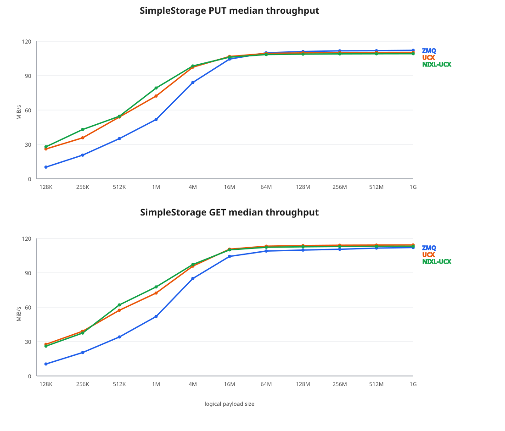
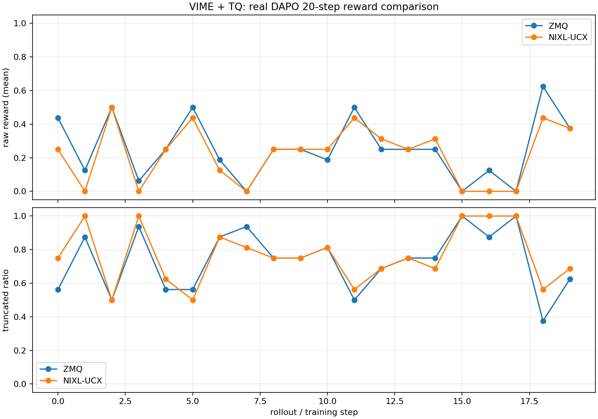

# SimpleStorage ZMQ / UCX / NIXL-UCX 性能与 VIME 验证报告

> 本文记录 SimpleStorage 的 ZMQ、原生 UCX 对照路径和 NIXL-UCX 路径的验证结果。配置 NIXL-UCX 后，所有非空 payload 走 NIXL-UCX，ZMQ 只保留控制面。

## 当前结论

- 本报告中的 SimpleStorage ZMQ、UCX、NIXL-UCX Host payload 路径均完成了跨节点 PUT/GET/CLEAR 和数据校验，完整矩阵 33/33 个 case 为 PASS。
- 固定同一批真实 rollout payload 后，ZMQ 与 NIXL-UCX 的 tokens、长度、mask、reward、raw reward、截断标记、sample index、rollout logprob digest 完全一致；loss、entropy loss、logp diff 完全一致，未发现 NIXL-UCX 引入的数据或精度损坏。
- 单机 VIME + TQ + NIXL-UCX 使用 80 道不重复的真实 DAPO 题完成 20/20 step；ZMQ 对照也完成 20/20 step。两条链路的 raw reward 和截断率处于同一范围，运行过程中均未出现 reward 崩溃、乱码、无法终止或 OOM。
- 20-step 长跑由两次独立 rollout 生成，逐 step token/reward 不作相等性比较；精度结论采用固定 payload replay，长跑用于观察功能、生命周期和 reward/truncation 趋势。
- 单机配置使用 UCX_TLS=sm,self,tcp、UCX_NET_DEVICES=lo，验证的是本地 NIXL-UCX 集成，不代表 RoCE/RDMA 或跨节点 VIME 已验收。

## 1. SimpleStorage 跨节点性能

测试于 2026-08-24 在 A2-26 (178.123.4.4) 和 A2-27 (178.123.4.3) 完成，Ray 两节点集群，128 KiB 至 1 GiB，共 33 个 case，数据校验全部通过。表中为 PUT/GET median 吞吐，单位 MiB/s。

| payload | ZMQ | UCX | NIXL-UCX |
| ---: | ---: | ---: | ---: |
| 128 KiB | 10.23 / 10.45 | 26.04 / 27.63 | 27.95 / 26.06 |
| 256 KiB | 20.67 / 20.46 | 35.75 / 35.02 | 43.03 / 41.49 |
| 512 KiB | 35.09 / 34.04 | 53.93 / 53.34 | 54.58 / 58.01 |
| 1 MiB | 51.73 / 51.88 | 72.23 / 72.35 | 79.22 / 77.70 |
| 4 MiB | 84.07 / 85.04 | 97.43 / 95.85 | 98.44 / 97.22 |
| 16 MiB | 104.47 / 104.33 | 106.75 / 106.65 | 106.16 / 106.04 |
| 64 MiB | 109.92 / 109.01 | 109.38 / 109.22 | 108.42 / 108.30 |
| 128 MiB | 111.05 / 109.85 | 109.83 / 109.77 | 108.79 / 108.71 |
| 256 MiB | 111.65 / 110.54 | 110.07 / 110.06 | 109.00 / 109.01 |
| 512 MiB | 111.76 / 111.58 | 110.22 / 110.19 | 109.11 / 109.11 |
| 1 GiB | 112.09 / 111.92 | 110.30 / 110.29 | 109.17 / 109.18 |



该组测试中，128 KiB～4 MiB 时 UCX/NIXL-UCX 明显快于 ZMQ；64 MiB 以上三种方式都接近链路上限，NIXL-UCX 大 payload 比原生 UCX 略慢约 1%。

## 2. 真实 DAPO 长响应验证

使用 /home/datasets/dapo-math-17k/dapo-math-17k.jsonl、Qwen3-4B-Instruct-2507，固定 seed=1234、rollout_seed=42、关闭 shuffle、开启 eager/deterministic inference、n_samples_per_prompt=4。

| 运行 | response len mean/min/max | truncated | repetition | raw reward | entropy loss | logp diff |
| --- | ---: | ---: | ---: | ---: | ---: | ---: |
| ZMQ, max=8192 | 8192 / 8192 / 8192 | 1.0 | 0.0 | 0.0 | 0.1633633 | 0.0072657 |
| NIXL-UCX, max=20000 | 14600.75 / 8361 / 20000 | 0.5 | 0.5 | 0.0 | 0.1346515 | 0.0061354 |

两次运行的 loss、pg_loss、ppo_kl 和 grad_norm 均为 0，原因是该组真实样本 reward 全为 0，因此该组数据不提供 loss 精度证据。NIXL-UCX 20K 运行没有 OOM、NaN、Traceback、NIXL_ERR 或 UCX error，输出没有二进制乱码；运行中观察到模型重复输出和错误答案。

## 3. 固定真实 payload 的 ZMQ/NIXL-UCX 精度 replay

先用 ZMQ 生成并保存一批固定的真实 DAPO rollout，再分别通过 ZMQ 和 NIXL-UCX replay 同一份固定 payload。配置为 Qwen3-4B-Instruct-2507、8 个真实 prompt、每个 prompt 4 个 sample、global batch=32、seed=1234、rollout_seed=42、response max=1024。

| 指标 | ZMQ replay | NIXL-UCX replay | 结论 |
| --- | ---: | ---: | --- |
| raw reward | 0.375 | 0.375 | 一致 |
| response length | 801.5625 | 801.5625 | 一致 |
| truncated | 0.53125 | 0.53125 | 一致 |
| loss | -7.450580596923828e-09 | -7.450580596923828e-09 | 一致 |
| pg_loss | -7.450580596923828e-09 | -7.450580596923828e-09 | 一致 |
| entropy_loss | 0.17829982936382294 | 0.17829982936382294 | 一致 |
| logp diff | 0.0080028735101223 | 0.0080028735101223 | 一致 |
| ppo_kl | 0.0 | 0.0 | 一致 |
| grad_norm | 0.5211178066299796 | 0.5208552991685566 | 相对差约 0.05% |

两条链路的 TQ_PAYLOAD_DIGEST 在 put_pre 和 get_post 间，以及 ZMQ/NIXL 两条链路之间，以下 9 类字段全部相同：

~~~text
tokens             86dcf2b079c9cd20
total_lengths      20bc71384c5f9c29
response_lengths   bf640a8a8723e22d
loss_masks         2ca2a537e34555fa
rewards            3aa04748d69894a3
raw_reward         86963b33d6f04636
truncated          d0576707697269c0
sample_indices     4459459e1764134c
rollout_log_probs  802f4fe222ef83f8
~~~

这组 replay 是当前判断 NIXL 是否引入精度问题的主要证据：传输前后的训练输入和 rollout logprob 相同，前向 entropy、loss、logp diff 相同；grad norm 的微小差异属于独立训练进程的运行时数值差异。

## 4. 80 道真实 DAPO 题的 20-step reward 对照

从真实 DAPO 原题库确定性选择 80 道不重复题目，题面长度约 260～784 字符；两条链路均使用同一批题目，每 step 4 个 prompt × 4 个 sample，global batch=16，response max=2048，vLLM max model len=4096，固定 seed=1234、rollout_seed=42、关闭 shuffle，并开启 eager/deterministic inference。



| 指标 | ZMQ | NIXL-UCX |
| --- | ---: | ---: |
| 完成 step | 20/20 | 20/20 |
| raw reward mean/min/max | 0.25625 / 0.0 / 0.625 | 0.221875 / 0.0 / 0.5 |
| truncated mean/min/max | 0.734375 / 0.375 / 1.0 | 0.765625 / 0.5 / 1.0 |
| response length mean | 1810.531 | 1819.287 |
| entropy loss mean | 0.239102623 | 0.238708921 |
| logp diff mean | 0.009636145 | 0.009639767 |

两次长跑都出现了 raw reward=0 和 response 达到 2048 的 step，也都出现了非零 reward 和较低截断率的 step；两条链路均未出现全程 reward=0、输出乱码、无法终止或 OOM。两次运行独立生成，逐 step reward 差异不用于 bitwise 精度判断。

## 5. 运行指南

每个节点确认 RDMA 设备和端口正常，并在启动 TQ/Ray 前完成 NIXL、UCX 动态库和
`ulimit -l unlimited` 的配置。源码构建按
[NIXL-UCX Host Payload 说明](nixl_ucx_payload.md)执行；wheel 直接安装：

```bash
python -m pip install nixl
cd <tq_source>
python -m pip install -e .
ulimit -l
ulimit -l unlimited
```

`ulimit -l unlimited` 必须在启动 TQ/Ray 的 shell 中成功，并由所有 Ray worker
继承。如果返回 `Operation not permitted` 或仍是很小的数值，先修复容器或服务的
memlock 限制；否则 NIXL 可能在 `ibv_create_cq` 或内存注册阶段失败。

### wheel 的 UCX/verbs 前置

NIXL wheel 自带 UCX，但仍依赖系统的 `rdma-core`、`libibverbs` 和网卡 provider。
每个节点都要检查设备和 provider，并找到 wheel 自带的 UCX transport 模块目录：

```bash
ls /sys/class/infiniband
rdma link show
ibv_devinfo

NIXL_SITE=$(python -c 'import site; print(site.getsitepackages()[0])')
UCX_MODULE_DIR=$(find "${NIXL_SITE}" -type d -path '*/nixl*.libs/ucx' -print -quit)
test -n "${UCX_MODULE_DIR}"
export UCX_MODULE_DIR
```

如果 UCX 日志出现 `transport 'rc_verbs' is not available`，除了设置
`UCX_MODULE_DIR`，还要确认 wheel 的 `libibverbs-*.so.*` 能解析到系统
`/usr/lib64/libibverbs.so.1`，并且系统 HNS/RoCE provider 可加载。不同 wheel 的
hash 文件名不同，不能直接照抄其他机器的软链接名；可按本机实际文件名建立临时
loader 目录：

```bash
WHEEL_LIB_DIR=$(dirname "${UCX_MODULE_DIR}")
WHEEL_IBVERBS=$(find "${WHEEL_LIB_DIR}" -maxdepth 1 -name 'libibverbs-*.so.*' -print -quit)
if [ -n "${WHEEL_IBVERBS}" ]; then
  TQ_IBVERBS_LOADER=/tmp/tq-nixl-ibverbs-loader
  mkdir -p "${TQ_IBVERBS_LOADER}"
  ln -sfn /usr/lib64/libibverbs.so.1 \
    "${TQ_IBVERBS_LOADER}/$(basename "${WHEEL_IBVERBS}")"
  export LD_LIBRARY_PATH="${TQ_IBVERBS_LOADER}:${WHEEL_LIB_DIR}${LD_LIBRARY_PATH:+:${LD_LIBRARY_PATH}}"
fi
```

该检查和环境设置必须在两台节点上完成，并在启动 Ray/TQ 前生效；Ray 已经启动时，
需要重启相关 worker 使其继承新环境。

```yaml
backend:
  storage_backend: SimpleStorage
  SimpleStorage:
    payload_transfer:
      backend: nixl-ucx
      ucx_env_vars: {}
```

检查 NIXL backend：

```bash
python - <<'PY'
from nixl import nixl_agent, nixl_agent_config

config = nixl_agent_config(
    enable_prog_thread=True,
    enable_listen_thread=True,
    listen_port=0,
    backends=["UCX"],
)
agent = nixl_agent("tq-nixl-check", config)
assert "UCX" in agent.backends
PY
```

### A2 双机配置和验收

A2-26/A2-27 当前验证通过的关键配置如下。`UCX_MODULE_DIR` 使用上一步找到的
目录；GID 3 必须先在两台机器的 GID 表中确认是 RoCE v2。A2 上不要额外设置
`UCX_NET_DEVICES` 或 `UCX_IB_ADDR_TYPE`，让 UCX 自动选择活动的 HNS 端口：

```bash
export UCX_MODULE_DIR=<nixl_wheel_libs>/ucx
export UCX_TLS=rc_verbs,tcp,sm,self
export UCX_IB_GID_INDEX=3
unset UCX_NET_DEVICES
unset UCX_IB_ADDR_TYPE
```

如果其他机器的 GID 索引不同，以 `ibv_devinfo`、GID 表和 `ucx_info -d` 的实际结果
为准，不要机械复制 `3`。显式指定错误的设备、GID 或 `UCX_IB_ADDR_TYPE` 会导致
`no connect to iface`、`Destination is unreachable`，此时先恢复 UCX 自动选设备并
重新核对 GID。

启动验证时打开 UCX 日志：

```bash
export UCX_LOG_LEVEL=info
export UCX_LOG_FILE=/tmp/tq-ucx-%h-%p.log
```

在两台节点启动 TQ/Ray 后，至少完成一次跨节点 PUT/GET/CLEAR，检查 GET 内容与 PUT
一致，并在两台节点的日志中确认：

```bash
grep -E 'rma\(|UCX_\* env' /tmp/tq-ucx-*.log
```

日志中必须出现 `rma(rc_*/<device>)` 才能证明 payload 使用 RDMA；
`rma_am(tcp/...)` 或 `rma(tcp/...)` 只能说明 TCP 控制/回退路径可用，不能作为 RDMA
通过依据。
